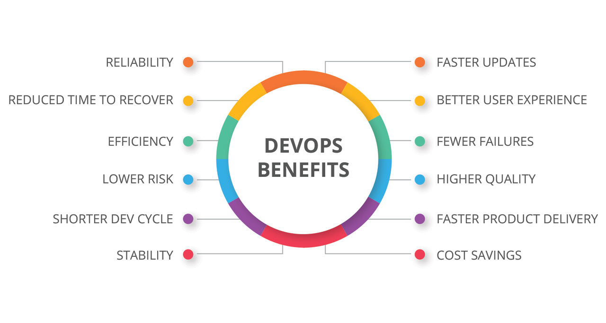

# ***What is DevOps?***
In this Markdown file we will go through what **DevOps** is, its benefits  and its particularities. Let`s get into it!

### Let`s first establish what DevOps is, shall we? ###
1. By definition, **DevOps** outlines a _software development process_ and an _organizational culture shift_ that speeds the delivery of higher quality software by automating and integrating the efforts of development and IT operations teams – two groups that traditionally practiced separately from each other, or in _silos_.

2. In practice, the best **DevOps** processes and cultures extend beyond development and operations to incorporate inputs from all application stakeholders - including platform and infrastructure engineering, security, compliance, governance, risk management, line-of-business, end-users and customers - into the software development lifecycle.
     

### So, what are some DevOps benefits? ###

The value of DevOps is **BIG**. Nearly all (99%) of respondents said DevOps has had a positive impact on their organization, according to the 2020 DevOps Trends Survey. Teams that practice DevOps ship better work faster, streamline incident responses, and improve collaboration and communication across teams.

Here is a picture that can highlight easier all the benefits of DevOps:

Now that we have established what DevOps is and its numerous benefits, let`s look into how it actually works.  

1. First, let`s understand the **processes** behind DevOps:
     
2. Now, let`s look at the **tools** used in DevOps:
       

### The man behind the curtain. ###
So far we have explained _what_ **DevOps** _is_, and we discussed _it`s benefits_. We also looked at the _processes and tools_ behind DevOps. But how about the **people** that _do the job_? 
    
A DevOps engineer is an extremely skilled individual, both technically and interpersonally.  
1. Firstly, it is an IT generalist who should have a wide-ranging knowledge of both development and operations, including coding, infrastructure management, system administration, and DevOps toolchains. 
2. Secondly, it is a strong team player, with outstanding communication skills, since DevOps requires working across company silos to create a more collaborative environment. 

#### Overall... ####
Instead of thinking of DevOps, which often uses IT/DevOps management software, as a singular solution, it should be viewed as an **overarching philosophy** — generally speaking, the DevOps concept has been developed to _bridge the gap_ between two traditionally siloed teams, development and operations. More specifically, through agile processes, the _two teams work in concert_ to optimize productivity and reliability, ultimately providing **better services to customers**.A DevOps strategy is more than just a single solution — it encompasses multiple software systems and departments to create a _unified, efficient approach to developing and operating applications and services_. 
    